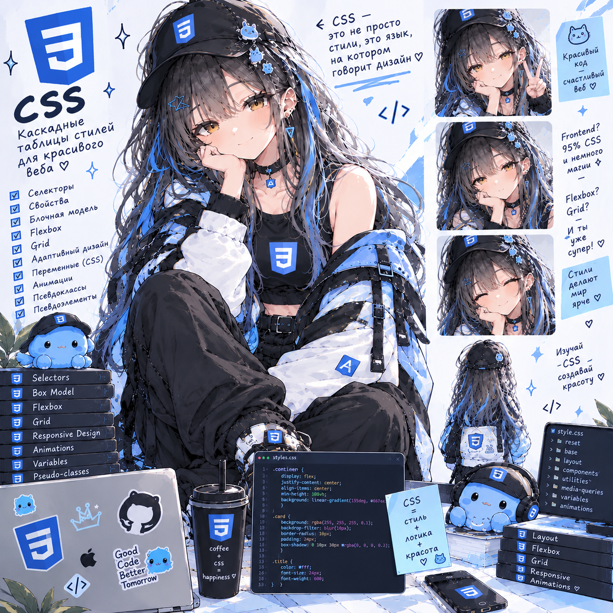

# CSS Lab — FrontFest

> **30.09.2026 — методичка вычитана и исправлена.** Что найдено и что поправлено — в [fixes/frontend/css.md](https://github.com/meeymirita/lab-fixes/blob/main/frontend/css.md) репозитория `lab-fixes`.

**Статус: ⚪ методичка вычитана и проверена запуском (04.10.2026), прохождение впереди.**
**Сложность: базовая.** Проект самостоятельный (свой репозиторий `css-lab`), кода из других лаб не берёт. Нужны только HTML и браузер. Во фронтенд-треке идёт первой — до Tailwind Lab и JS.

## О чём

Современный CSS с нуля на сайте фронтенд-конференции FrontFest: главная, программа-таймлайн, регистрация. Разметка выдаётся готовой — вы пишете только стили. Каскад и слои → токены, цвет и темы → Flexbox → Grid и subgrid → адаптив, container queries, `:has()` и формы → позиционирование, анимации, view transitions и сборка. Без фреймворков и препроцессоров.

## Стек

Чистый CSS, HTML-страницы, отдаваемые nginx в Docker. Главный инструмент — DevTools (Elements → Styles, Computed, Layout). Основная часть укладывается в Baseline; более новые возможности помечены «прогрессивное улучшение».

## Формат

Методичка [`CSS_Lab_FrontFest.html`](CSS_Lab_FrontFest.html) — открывается в браузере, прогресс по чекбоксам сохраняется локально. У каждого шага: код → «зачем» → команда → ожидаемый результат → «проверь себя»; ответы — в `docs/css-notes.md`.

## Что внутри (6 сессий, ~20 ч)

- **Сессия 1** (~3 ч) — основы и каскад: стенд, reset, типографика, `@layer` вместо войны специфичности, схлопывание margin
- **Сессия 2** (~3,5 ч) — токены, цвет, темы, текст: custom properties, `oklch`, `color-mix`, `light-dark()`
- **Сессия 3** (~3 ч) — Flexbox: шапка, `grow`/`shrink`/`basis`, `min-width: auto`, карточки тарифов
- **Сессия 4** (~3,5 ч) — Grid: каркас и full-bleed, `auto-fill`/`auto-fit`, таймлайн программы, `subgrid`
- **Сессия 5** (~3,5 ч) — адаптив, container queries, `:has()`, nesting, формы и фокус
- **Сессия 6** (~3,5 ч) — `sticky` и контексты наложения, анимации, `@property`, popover, view transitions, сборка

Разделы 1–9 методички — теория, раздел 10 — шесть сессий заданий, разделы 11–14 — чек-лист, глоссарий, вопросы для собеседования, что дальше.

---

Часть сборного репозитория лабораторных работ — [anitech-performance](https://github.com/meeymirita/anitech-performance).
